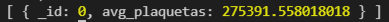
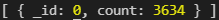
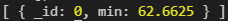
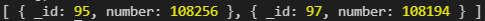
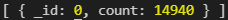
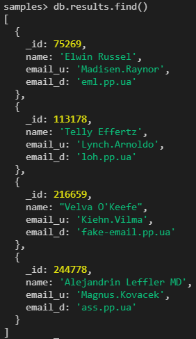
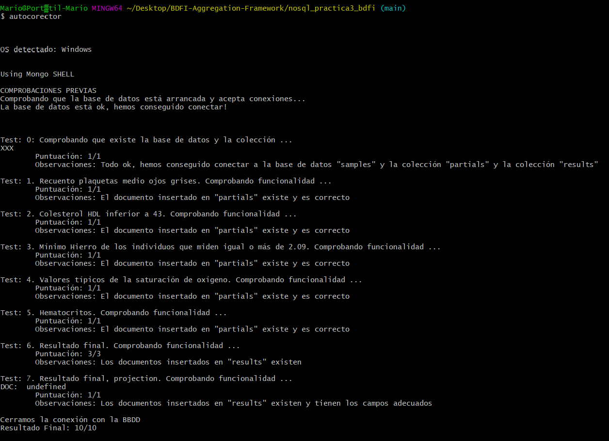

# BDFI-Aggregation-Framework
# Práctica Aggregation Framework MongoDB
## Objetivos
Aprender MongoDB con un caso un poco más realista que los anteriores (BDFI-mongodb-shell). En el que habrá que utilizar el agreggation framework y hacer queries un poco más avanzadas.

## Enunciado e instrucciones resumidas
Bajar el archivo samples.json que está en Moodle e importarlo a nuestra base de datos.

### Enunciado 
Trabajamos en un hospital y se dispone de una gran coleccion de datos en MongoDB con los resultados de análisis de sangre. El objetivo es filtrar, mediante varios parámetros, los pacientes que tienen una mayor probabilidad de sufrir cáncer y por lo tanto deberían hacerse pruebas avanzadas.

Estos parámetros son:
1. Recuento de plaquetas inferior a la media de los que tienen ojos grises
2. El colesterol bueno o HDL está bajo, por debajo de 43
3. El hierro es superior al mínimo hierro de los individuos que miden más de 2.09m
4. Tienen en su array al menos uno de los dos valores más típicos de la saturación de oxígeno en sangre
5. Los hematocitos, medidos en porcentaje, tambien está bajo, inferior a 42%

Crear con todos estos parámetros una query final que obtiene los pacientes sospechosos de tener cáncer y se pasen esos resultados a otra colección de la misma bbdd llamada "results".

### Probar la práctica y subir la nota a Moodle empleando el autocorrector

## Pasos realizados y Resultados

### 0. Instalación de herramientas necesarias y conexión a base de datos

Para la realización de la práctica es necesario tener instalados:

1. MongoDB Community Edition
2. MongoDB Compass (Necesario incrementar `limit` a 1000000)
3. MongoDB Shell (mongosh)
4. MongoDB Database Tools
5. Git
6. Node
7. Npm
7. Autocorector. Una vez instalado node, el autocorector se instala con:
```
npm install -g autocorector
```
Se descarga al archivo `samples.json` de la URL dada en Moodle y se importa a la base de datos de MongoDB mediante:

```
cd "C:\Program Files\MongoDB\Server\5.0\bin"
.\mongoimport.exe -d samples -c blood --file "C:\Users\mario\Desktop\BDFI-Aggregation-Framework\samples.json"

```

Se inicia el mongo shell:

```
cd C:\Users\mario\AppData\Local\Programs\mongosh\
mongosh.exe
```

Usar la BBDD samples:

```
> use samples
```
### 1. Tienen el recuento de plaquetas inferior a la media de los que tienen ojos grises (Gray)
Guardar el valor calculado en “partials” así { mediagrises: XXX }


```
> db.blood.aggregate(
    {$match: {eye: {$eq: 'Gray'}}},
    {$group: 
        {_id:0,
        avg_plaquetas: {$avg: "$hemograma.Plaquetas"}
        }
    }    
)
```


```
db.partials.insertOne({mediagrises:275391.558018018})
```

### 2. El colesterol bueno o HDL lo tienen también bajo, inferior a 43. 
En la colección hay un array llamado HDL_LDL, donde HDL es la primera posición y LDL la segunda. Guardar el número de pacientes que cumplen esta condición en “partials” así { HDLbajo: XXX }

```
db.blood.aggregate([ 
    {$match: {"bioquimica.HDL_LDL.0": {$lt: 43} }}, 
    {$group: {
        _id: 0, 
        count: {$sum: 1}
        }
    } 
])
```

```
db.partials.insertOne({HDLbajo:3634})
```

### 3. El hierro es superior al mínimo hierro de los individuos que miden igual o más de 2.09m.
Guardar el resultado de esta condición en “partials” así { MinHierro: XXX }

```
db.blood.aggregate([
    {$match: {height: {$gte: 209}}}, 
    {$group: { 
        _id: 0, 
        min: {$min: "$bioquimica.Hierro"}
        } 
    } 
])
```

```
db.partials.insertOne({MinHierro:62.6625})
```

### 4. Los individuos buscados tienen en su array al menos uno de los dos valores más típicos de la saturación de oxígeno en sangre. 
Cada individuo tiene 3 muestras, con valores entre 95 y 100 y están en un array de nombre muestras_SPO2. (Ayuda: Primero habrá que calcular qué valor se repite más en este array y luego usar este valor para la búsqueda final).

Guardar el resultado de esta condición en “partials” así {
muestras: [XXX, YYY] }

```
db.blood.aggregate([
    { $unwind : "$muestras_SPO2" },
    { $group : { _id : "$muestras_SPO2" , number : { $sum : 1 } } },
    { $sort : { number : -1 } },
    { $limit : 2 }
])
```

```
db.partials.insertOne({muestras:[95,97]})
```

### 5. Los hematocritos (que normalmente se miden en porcentaje y se expresanen los resultados como “hto”), también lo tienen bajo, inferior a 42%”
Guardar el número de pacientes que cumplen esta condición
en “partials” así { hematocritos: XXX }

```
typeof db.blood.findOne().hemograma.hto
```
```
db.blood.aggregate([ 
    {$addFields: 
        {htoNumber: {$toDouble: {$substrBytes: ["$hemograma.hto", 0, 5]}}}}, 
    {$match : {htoNumber: {$lt : 42 } }}, 
    {$group: 
        { _id: 0, 
        count: {$sum: 1} } }
])
```

```
db.partials.insertOne({hematocritos:14940})
```


### 6. Queremos analizar estos datos para poder ponernos en contacto con las personas que puedan ser susceptibles de cumplir estas 5 condiciones.
Para ello queremos que la query final que obtiene los pacientes sospechosos de tener cancer escriba el _id del documento, nombre, email_u e email_d (importante, no todo el documento, usar “$project”) a otra colección en la misma base de datos llamada “results” (para esto utilizar $out del aggregation framework).
```
db.blood.aggregate([
    {$match: {
        "hemograma.Plaquetas": {$lt: 275391.558018018},
        "bioquimica.HDL_LDL.0": {$lt: 43}, 
        "bioquimica.Hierro": {$gt: 62.6625},
        "muestras_SPO2": {$in: [95,97]},  
        "hemograma.hto": {$lt: "42.00%"}
    }},
    {$project: { 
        name: 1, 
        email_u: 1,
        email_d: 1 
    }},
    {$out: {db:"samples", coll:"results"}}
])
```



### 7. Evaluación mediante autocorector


